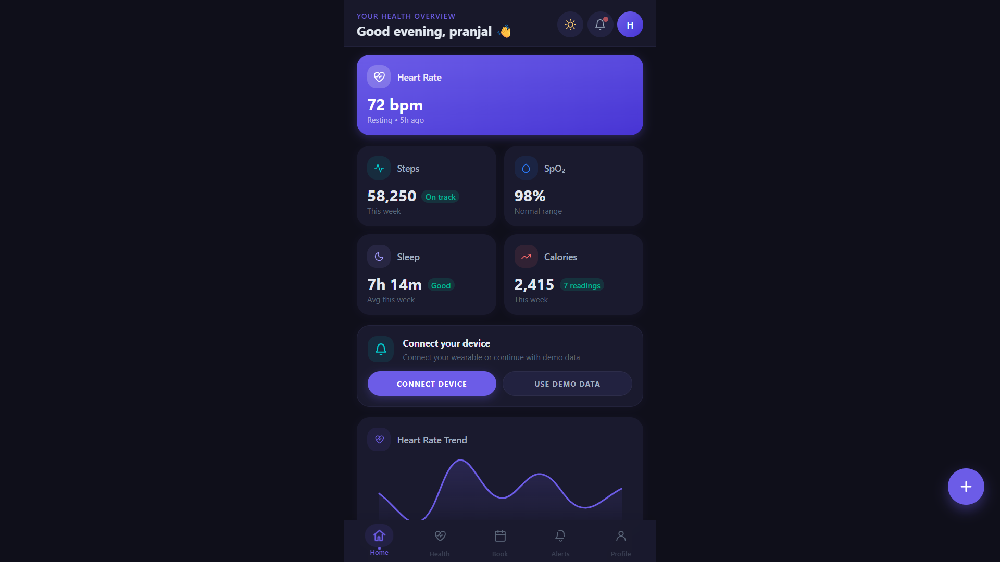
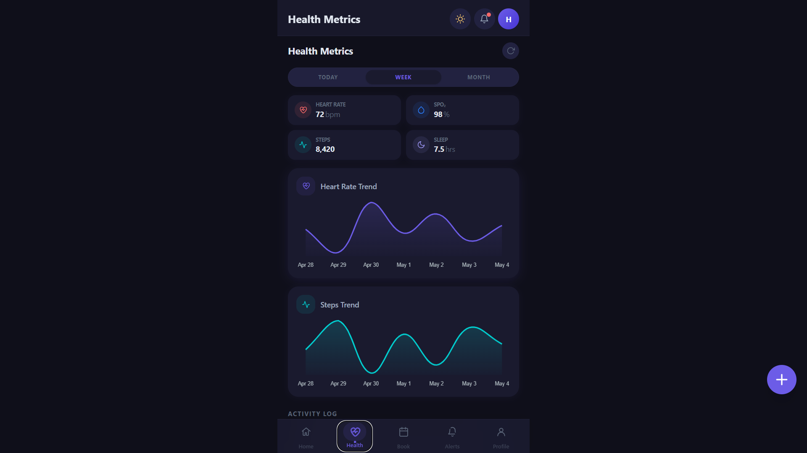
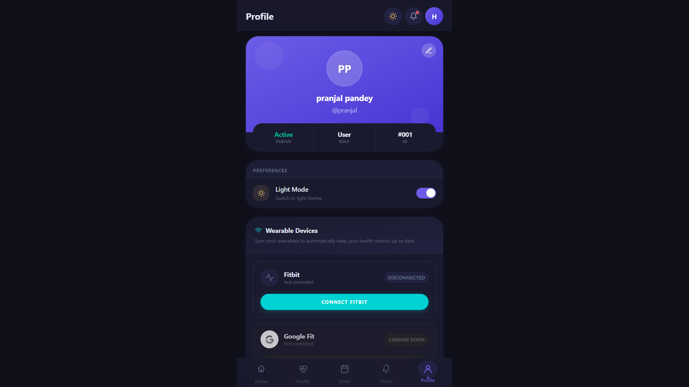
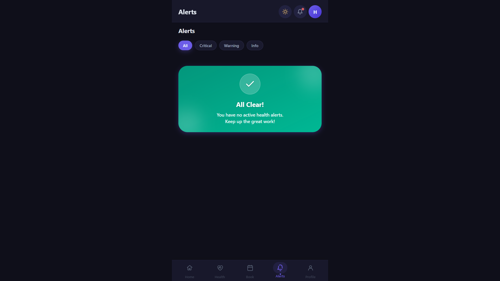

# 🚀 HealthPulse

HealthPulse is a full-stack, mobile-first health monitoring web application that enables users to track health metrics, simulate wearable device integration, and manage doctor appointments.

---

## 🌐 Live Demo

* **Frontend (Vercel):** [https://health-monitoring-app-w9qj.vercel.app](https://health-monitoring-app-w9qj.vercel.app/)
* **Backend (Render API):** [https://pulsehealth-backend-ipmi.onrender.com](https://pulsehealth-backend-ipmi.onrender.com)

⚠️ **Note:**
The backend is hosted on Render (free tier).
If the app is inactive, the server may sleep — please wait **30–60 seconds** on first load.

---

## 📸 Screenshots

<div align="center">
  
  
  
  
</div>

---

## ✨ Features

* 🔐 JWT-based authentication (Signup & Login)
* 🧭 Multi-step onboarding flow
* ❤️ Health tracking (heart rate, steps, sleep, SpO2)
* 📊 Dashboard with charts and insights
* 📅 Doctor appointment booking system
* 🔌 Simulated wearable integration (demo data)
* 📱 Mobile-first responsive UI

---

## 🧠 Tech Stack

### Frontend

* React (Vite)
* React Router
* Axios

### Backend

* Django
* Django REST Framework
* JWT Authentication (SimpleJWT)

### Database

* SQLite (development)

---

## ⚙️ Deployment

* Frontend → Vercel
* Backend → Render

---

## 🔄 How It Works

1. User signs up
2. Completes onboarding
3. Connects demo device or adds data manually
4. Views health dashboard
5. Books doctor appointments

---

## 🐛 Real-World Issues Solved

* Fixed Axios baseURL issue causing incorrect API routing
* Resolved CORS failures due to custom headers
* Configured static file handling in production (WhiteNoise)
* Removed incompatible PWA plugin (Vite build issue)
* Fixed dependency and environment variable issues

---

## ⚠️ Limitations

* No real wearable integration (currently simulated)
* No real-time updates (no WebSockets)
* Backend may take time to wake up (Render free tier)

---

## 🔮 Future Scope

* Fitbit / Google Fit integration
* AI-based health insights
* Real-time alerts & notifications
* Doctor dashboard

---

## 👨‍💻 Project Overview

This project focuses on solving real-world full-stack challenges including:

* Frontend–backend integration
* Authentication and API design
* Deployment and environment configuration
* CORS and networking issues

---

## 📌 Setup (Optional for Local Run)

```bash
# Clone repo
git clone <your-repo-url>

# Backend
cd server
pip install -r requirements.txt
python manage.py runserver

# Frontend
cd client
npm install
npm run dev
```

---

## 🏁 Final Note

HealthPulse demonstrates a production-like full-stack workflow including deployment, debugging, and integration challenges typically faced in real applications.

---
